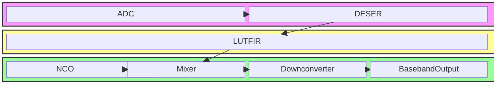

# NessSDR firmware

```mermaid

block-beta
columns 1
  block:ADC_CLK
    ADC
    DESER
  end
  block:IF_PROC_CLK
    LUTFIR
  end
  block:BB_PROC_CLK
    NCO
    Mixer
    Downconverter
    BasebandOutput
  end
  
  %% Add descriptions for the arrows
  ADC --> DESER
  DESER --> LUTFIR

  NCO --> Mixer
  LUTFIR --> Mixer
  Mixer --> Downconverter
  Downconverter --> BasebandOutput

  style ADC_CLK fill:#f9f,stroke:#333,stroke-width:2px,width:100%,padding:10%
  style IF_PROC_CLK fill:#ff9,stroke:#333,stroke-width:2px,width:100%,padding:10%
  style BB_PROC_CLK fill:#9f9,stroke:#333,stroke-width:2px,width:100%,padding:10%

  style NCO width:30%,padding:10%
```